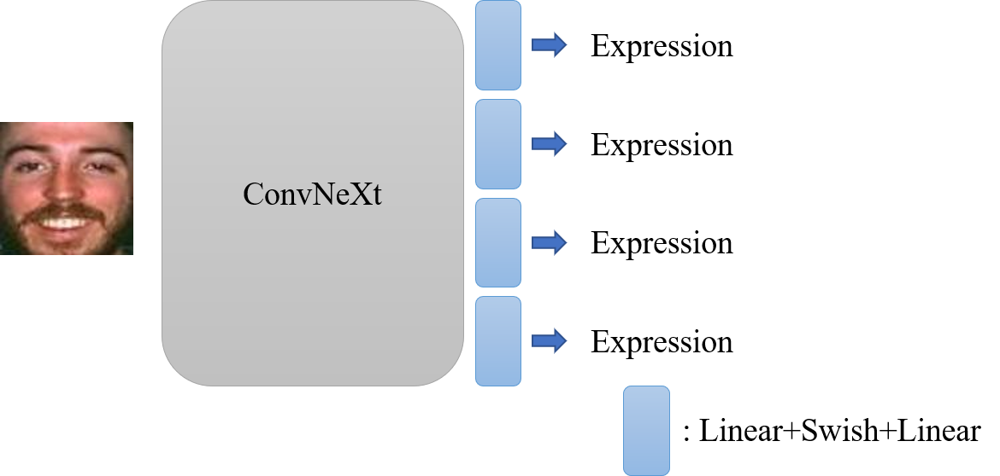

# Multi head FER: a 90.97 solution for RAF-DB


</p>
We propose a multi head trick for FER. With ConvNeXt-B backbone, we achieve 90.97 acc on RAF-DB dataset.

## Results and Pre-trained Models

| name                  | resolution | acc   | #params | FLOPs | model                                                                                       |
|-----------------------|------------|-------|---------|-------|---------------------------------------------------------------------------------------------|
| ConvNeXt-T            | 224x224    | 90.68 | 28M     | 4.5G  | -                                                                                           |
| ConvNeXt-B-Glint-mini | 224x224    | -     | 89M     | 15.4G | [model](https://drive.google.com/file/d/1eXOIhFpkqsM6iwEOlD1NMTHUiYl51cKH/view?usp=sharing) |
| ConvNeXt-B-stage-1    | 224x224    | 90.81 | 89M     | 15.4G | [model](https://drive.google.com/file/d/1gMsPvszdJmWUe7NLc40gOzFvSgLa6HQC/view?usp=sharing) |
| ConvNeXt-B-KD         | 224x224    | 90.97 | 89M     | 15.4G | [model](https://drive.google.com/file/d/15SMaczU4vX9PTmU0JaFmM4N00g-R2Flk/view?usp=sharing) |


## Training and Evaluation

First stage
```
python train.py --lr 0.001 --gamma 0.92 --bs 64
```

KD
```
python train_KD.py --lr 0.0006 --gamma 0.92 --bs 64 --tau 1.7 1.7 1.7 1.7
```

Eval
```
python test.py
```